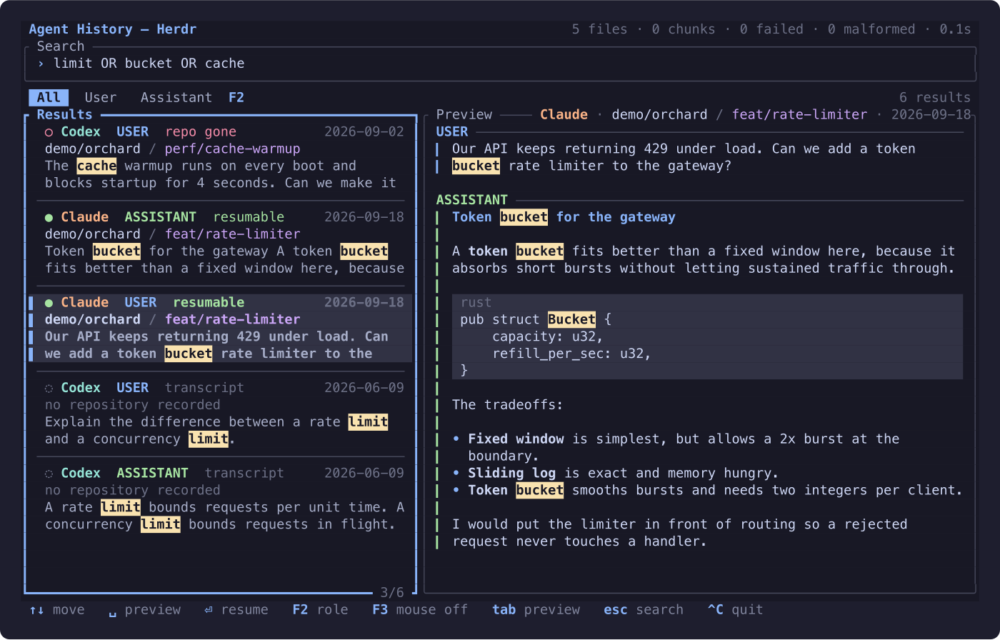

# Agent History

Local Claude Code and Codex conversation search for macOS. Search and preview work independently; optional Herdr integration adds session resume and worktree recovery.



*Running inside Herdr, so colors follow the configured Herdr theme and Enter resumes the selected session. The conversations shown are fictional fixtures, not captured history.*

## Two ways to run it

Agent History runs **with or without Herdr**. Searching, previewing and indexing never need Herdr, a running coding agent, or a network connection — they read the native transcript files already on disk.

| | Standalone | Inside Herdr |
| --- | --- | --- |
| Command | `agent-history browse` (or `agent-history-overlay`) | `agent-history-herdr`, usually via the plugin pane |
| Search, role filters, preview | yes | yes |
| <kbd>Enter</kbd> | opens the conversation preview | resumes that Claude or Codex session |
| Worktree recovery | not offered | offered, and never mutates Git without confirmation |
| Colors | your terminal's own palette | the theme from Herdr's `config.toml` |
| Requires | nothing but the binary | Herdr, plus the matching agent executable to resume |

The standalone build has no dependency on the Herdr crate and does not read Herdr's configuration; the two entry points simply share the same index. Install the integration only if you want it:

```sh
./install                # standalone only
./install --with-herdr   # also installs the integration and plugin
```

## Status

A local 0.1.0 candidate implements the CLI, terminal overlay, SQLite indexing, and confirmed worktree recovery. **V1 is not released:** real native-agent resume in Herdr and clean-user macOS installation acceptance remain pending. See [release status](docs/RELEASE_STATUS.md), [indexing limitations](docs/INDEXING.md), and [synthetic performance measurements](docs/PERFORMANCE.md).

## Download

Download the Apple Silicon macOS package from [v0.1.0-rc.1](https://github.com/mikitahimpel/herdr-agent-history/releases/tag/v0.1.0-rc.1). This is a prerelease; native resume and clean-user installation acceptance remain pending. Intel macOS, Windows, and Linux binaries are not included.

Extract `agent-history-macos-arm64.tar.gz`, open a terminal in the extracted `agent-history` folder, and run `./install` (standalone) or `./install --with-herdr` (optional integration). Add `~/.local/bin` to your PATH, then run `agent-history browse`. See below for Herdr plugin registration.

## Build and install

Apple Silicon macOS is the packaged target. Searching existing native history files requires no Herdr installation or running coding agent. Resuming through the optional integration requires Herdr and the corresponding Claude Code or Codex executable; these are not bundled. The adapter targets the installed Herdr 0.7.1 CLI, with official native-session integrations enabled. Native compatibility evidence and remaining checks are in [host compatibility](docs/HOST_COMPATIBILITY.md).

```sh
./scripts/setup
./scripts/package
```

The archive and SHA-256 checksum are written to `dist/`. Extract the archive, then run its installer:

```sh
tar -xzf agent-history-macos-arm64.tar.gz
cd agent-history
./install
```

The default installer places `agent-history` and the standalone `agent-history-overlay` in `~/.local/bin`; add that directory to `PATH`. Run `agent-history browse` in any terminal. Enter and Space on a selected result open its conversation preview.

To also install the optional Herdr executable and plugin, run `./install --with-herdr`. The plugin is copied to `~/.local/share/agent-history/plugin`. From a Herdr-managed pane:

```sh
herdr plugin link "$HOME/.local/share/agent-history/plugin"
herdr plugin pane open --plugin agent-history --entrypoint search
```

See [overlay controls and recovery](docs/HERDR_PLUGIN.md) for keyboard behavior and the declared plugin action that can be bound in Herdr. Indexing runs on activation; there is no permanent daemon.

## Standalone app and CLI

Build just the standalone app without compiling the Herdr integration:

```sh
cargo build --release -p agent-history-cli
./target/release/agent-history browse
```

The existing `./target/release/agent-history-overlay` launch command is also standalone. Use `agent-history-herdr` inside a Herdr-managed pane when you want Enter to resume. Its title and controls identify that integration explicitly.

Both builds share one keyboard model: type to search, **Down/Tab** focuses results, **Space** previews, **F2** cycles the role filter, **F3** toggles mouse capture, and **Esc** goes back. The mouse is additive — click a pane to focus it, click a result to select it, and scroll the pane under the pointer. Because capturing the mouse takes drag-to-select away from your terminal, **F3** hands it back; most terminals also keep selection available while holding **Shift** (iTerm2, Terminal.app, kitty, WezTerm) or **Option** (Alacritty).

```sh
agent-history index
agent-history search "portfolio visibility"
agent-history search "portfolio visibility" --role user
agent-history search "portfolio visibility" --role assistant
agent-history status
agent-history preview claude <native-session-id>
agent-history preview codex <native-session-id>
```

Search includes user messages and assistant replies, excluding tool calls/results, loaded files, reasoning, and system/developer messages. Code deliberately included in a message remains searchable. Use `--role user`, `--role assistant`, or `--role all` (the default); in the overlay, **F2** cycles the same filters. **Down/Tab** focuses results, **Space** previews, and **Esc** goes back.

Search uses SQLite FTS5: ordinary terms, quoted phrases, prefixes such as `portfolio*`, and boolean operators. Shell quoting must preserve FTS phrase quotes, for example `agent-history search '"portfolio visibility"'`.

Both apps share the existing index at `~/Library/Application Support/Herdr Agent History/index.sqlite`. The historical directory name is retained to reuse existing data; it does not imply a Herdr dependency. Use a dedicated private directory for `--db`; existing shared directories are refused. Custom histories are supported without changing native files:

```sh
agent-history index --db /tmp/agent-history-private/index.sqlite \
  --claude-root /path/to/claude/projects \
  --codex-root /path/to/codex/sessions
```

Default discovery honors `CLAUDE_CONFIG_DIR` and `CODEX_HOME`; Codex discovery includes archived sessions. Incomplete final records are retried. Failed sources are reported while unrelated files continue indexing. Source previews require an unchanged indexed generation; rerun `index` after new writes.

## Privacy and removal

Native JSONL is canonical and read-only. SQLite contains normalized searchable text, metadata, source references, and incremental checkpoints. It is sensitive local data and is rebuildable. No runtime transcript upload, telemetry, embeddings, or LLM processing is used.

From Herdr, unlink the plugin with `herdr plugin unlink agent-history`. Run the extracted package's `./uninstall` to remove the installed binaries and manifest. Uninstall preserves the index and native histories. For corruption or schema recovery, close all clients before removing only the disposable database and its SQLite sidecars; see [troubleshooting](docs/TROUBLESHOOTING.md).

## Development

| Crate | Responsibility |
| --- | --- |
| `agent-history-core` | Native adapters, chunks, transactional indexing, SQLite/FTS5, Git context, source preview |
| `agent-history-tui` | Shared terminal rendering, progress, role filters, search and preview; no Herdr dependency |
| `agent-history-cli` | Standalone app (`browse` / `agent-history-overlay`) and index/search/status/preview commands |
| `agent-history-herdr` | Optional integration executable, host commands, native resume and confirmed recovery |

See [module boundaries and entry points](docs/MODULES.md) for the standalone/integration split.

Run `./scripts/setup` once per checkout and `./scripts/check` after changes. The gate runs formatting, warnings-denied Clippy, all workspace tests, and the release build with the committed lockfile. `./scripts/test-packaging` checks isolated installation/removal behavior. Tests use synthetic histories and temporary repositories; they do not launch native agents.

[AGENTS.md](AGENTS.md), the [RFC](docs/RFC.md), and GitHub issues [#1–#13](https://github.com/mikitahimpel/herdr-agent-history/issues) define the scope. The [backlog map](docs/BACKLOG.md) connects the detailed work items. Remote CI and branch protection have not been verified in this implementation run.
