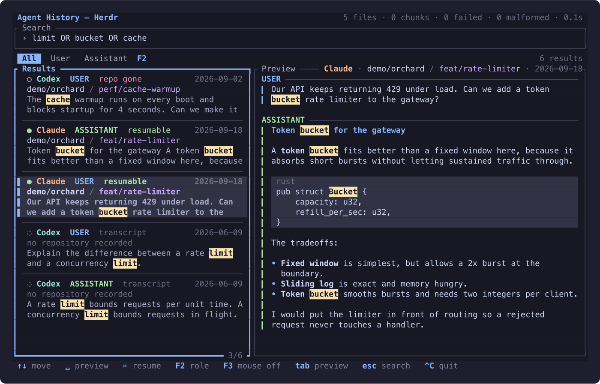

# Agent History

Local Claude Code and Codex conversation search for macOS. Search and preview work independently; optional Herdr integration adds session resume and worktree recovery.



*Running inside Herdr, so colors follow the configured Herdr theme and Enter resumes the selected session. The conversations shown are fictional fixtures, not captured history.*

## Two ways to run it

Agent History runs **with or without Herdr**. Searching, previewing and indexing never need Herdr, a running coding agent, or a network connection — they read the native transcript files already on disk.

| | Standalone | Inside Herdr |
| --- | --- | --- |
| Command | `agent-history browse` (or `agent-history-overlay`) | `agent-history-herdr`, usually via the plugin pane |
| Search, role filters, preview | yes | yes |
| <kbd>Enter</kbd> | opens the conversation preview | resumes that Claude or Codex session |
| Worktree recovery | not offered | offered, and never mutates Git without confirmation |
| Colors | your terminal's own palette | the theme from Herdr's `config.toml` |
| Requires | nothing but the binary | Herdr, plus the matching agent executable to resume |

The standalone build has no dependency on the Herdr crate and does not read Herdr's configuration; the two entry points simply share the same index. The [installer](#install) puts both programs in place; the Herdr side does nothing until you add the Herdr plugin.

## Status

The 0.1.0-rc.2 prerelease implements the CLI, terminal overlay, SQLite indexing, Herdr resume, and confirmed worktree recovery. **V1 is not released:** resume has been exercised live only on the development machine, and installation by a new user on a clean Mac remains pending. See [release status](docs/RELEASE_STATUS.md), [indexing limitations](docs/INDEXING.md), and [synthetic performance measurements](docs/PERFORMANCE.md).

These docs describe the current source. The published rc.2 predates a few changes, each marked **(after rc.2)** where it matters: searching punctuation such as `rate-limit`, near matches for misspelled words, `--` before a query, the release tag in `--version`, one-line error messages from the overlay binaries, and `./uninstall` removing its empty directories.

## Install

Apple Silicon macOS only — there are no Intel, Windows or Linux binaries. You need no Rust toolchain, no repository checkout, and no Herdr for search and preview. Run this in Terminal:

```sh
curl -fsSL https://raw.githubusercontent.com/mikitahimpel/herdr-agent-history/main/install.sh | sh
```

The [installer](install.sh) is one short script you can read first. It installs the release it names, currently the prerelease **[v0.1.0-rc.2](https://github.com/mikitahimpel/herdr-agent-history/releases/tag/v0.1.0-rc.2)**, and:

- prints the URL it downloads and every file it will create or replace before it starts;
- checks the archive against the SHA-256 written into the script and installs nothing if it differs (`CHECKSUM MISMATCH`);
- puts `agent-history`, `agent-history-overlay` and `agent-history-herdr` in `~/.local/bin`, without `sudo`, replacing an existing install by rename so running copies keep working;
- never edits your shell profile or Herdr configuration.

Options go after `sh -s --`: `--dry-run` prints the plan and stops before downloading anything, `--prefix DIR` installs into another absolute directory, and `--tag TAG` installs another release, checked against the checksum published with that release rather than one pinned in the script:

```sh
curl -fsSL https://raw.githubusercontent.com/mikitahimpel/herdr-agent-history/main/install.sh | sh -s -- --dry-run
```

To read the script before running it, download it with `curl -fsSLO …/install.sh`, then run `sh install.sh`.

If the installer reports that its directory `is not on your PATH`, add it for new Terminal windows and open one. macOS's default shell is zsh:

```sh
echo 'export PATH="$HOME/.local/bin:$PATH"' >> ~/.zshrc
```

Then `agent-history browse` searches your history. To resume sessions from Herdr as well, add the plugin; see [resume from Herdr](#optional-resume-from-herdr):

```sh
herdr plugin install mikitahimpel/herdr-agent-history/plugin/agent-history --ref v0.1.0-rc.2
```

### Install manually from a release

The same release can be installed by hand. It has two assets: `agent-history-macos-arm64.tar.gz` and its checksum, `agent-history-macos-arm64.tar.gz.sha256`. GitHub never marks a prerelease as "latest", so use the tag link above rather than the repository's *Latest release* shortcut. Run these in Terminal from any empty directory. They download both files, verify the checksum *before* anything is extracted, then install:

```sh
base=https://github.com/mikitahimpel/herdr-agent-history/releases/download/v0.1.0-rc.2
curl -fLO "$base/agent-history-macos-arm64.tar.gz"
curl -fLO "$base/agent-history-macos-arm64.tar.gz.sha256"
shasum -a 256 -c agent-history-macos-arm64.tar.gz.sha256   # must print: OK
tar -xzf agent-history-macos-arm64.tar.gz
cd agent-history
./install                # standalone
./install --with-herdr   # instead, to also install the Herdr integration and plugin
```

`./install` uses the same `~/.local/bin`; pass an absolute directory, for example `./install /opt/agent-history/bin`, to choose another. Keep the extracted folder if you want its `./uninstall` later.

rc.1 and rc.2 are not notarized by Apple. Downloading them with `curl` as above is fine, but if you download the archive **with a browser** and open it in Finder, macOS kills the installed programs (`Killed: 9`, “agent-history” Not Opened). [Troubleshooting](docs/TROUBLESHOOTING.md#agent-history-not-opened-or-killed-9) shows how to clear the quarantine. Releases are to be notarized from the next one on, which removes this step.

## First run: index, search, preview

```sh
agent-history index                          # read your Claude Code and Codex history
agent-history search "portfolio visibility"  # find a conversation
agent-history preview claude <session-id>    # read it; use codex for Codex results
agent-history browse                         # or do all of this interactively
```

`index` reads Claude Code history from `~/.claude/projects` (or `$CLAUDE_CONFIG_DIR/projects`) and Codex history from `~/.codex/sessions` and `~/.codex/archived_sessions` (or the same folders under `$CODEX_HOME`). It prints how many files it read; `indexed 0 files` means nothing was found in those places — see [troubleshooting](docs/TROUBLESHOOTING.md#search-returns-no-sessions). Rerun `index` whenever you want newer conversations included; `browse` also indexes when it starts.

`search` prints up to 50 matches, one per line, as tab-separated columns: rank, agent (`Claude` or `Codex`), role (`User` or `Assistant`), repository / branch (`- / -` when unknown), **session ID**, timestamp, source file and byte range, and the matching text. Give the agent and session ID from a result to `preview`:

```text
1	Claude	User	- / -	11111111-2222-4333-8444-555555555555	2026-09-20T10:00:00+00:00	…	Why is the portfolio visibility toggle hidden…
```

```sh
agent-history preview claude 11111111-2222-4333-8444-555555555555
```

A search with no matches prints nothing. In `browse`, type to search, press **Down** or **Tab** to reach the results, and **Space** or **Enter** to preview; **Esc** goes back and **Ctrl-C** quits. Resuming a session from the results needs the optional Herdr integration below.

### Upgrading and removing

To upgrade, close any running `agent-history browse` and run the install command again; it installs the release the script currently names, replacing the programs in place. After a manual install, download and verify the new release the same way and run its `./install` over the existing one. There is no need to uninstall first, and if you installed the Herdr plugin, update it to the same tag with `herdr plugin install … --ref <tag>` again. The index is kept and migrated automatically when needed. An older build refuses an index created by a newer one (`database schema version … is newer than supported`) rather than altering it.

To remove programs installed by the install command, delete them: `rm -f ~/.local/bin/agent-history ~/.local/bin/agent-history-overlay ~/.local/bin/agent-history-herdr`, and in Herdr run `herdr plugin uninstall agent-history`. After a manual install, run `./uninstall` from the extracted folder, passing the same directory if you installed somewhere other than `~/.local/bin`. It removes the binaries, the Herdr plugin manifest, and the `share/agent-history` directories once they are empty (rc.2 leaves those empty directories behind; remove them with `rmdir`), and deliberately keeps both your native Claude/Codex history and the search index. If you no longer have the folder, delete the files yourself: `rm -f ~/.local/bin/agent-history ~/.local/bin/agent-history-overlay ~/.local/bin/agent-history-herdr ~/.local/share/agent-history/plugin/herdr-plugin.toml`. See [privacy and removal](#privacy-and-removal) for deleting the index.

## Optional: resume from Herdr

Searching existing native history files requires no Herdr installation or running coding agent. Resuming through the optional integration requires Herdr and the corresponding Claude Code or Codex executable; these are not bundled. It requires **Herdr 0.9.3 or newer**; on an older Herdr, Enter reports the version it found and asks you to run `herdr update`. Native compatibility evidence and remaining checks are in [host compatibility](docs/HOST_COMPATIBILITY.md).

**1. Check what Herdr needs.** Run these in a pane inside Herdr:

```sh
herdr --version                 # herdr 0.9.3 or newer
command -v claude codex         # the agents you want to resume
herdr integration status        # claude and codex should say "current"
```

If `claude` or `codex` shows `not installed`, run `herdr integration install claude` (or `codex`). The integration lets Herdr report which session a running agent has open, so Agent History can switch to a session that is already running instead of starting it a second time.

**2. Install the programs.** The [install command](#install) already put `agent-history-herdr` in `~/.local/bin`; a manual install needs `./install --with-herdr`.

**3. Add the plugin and open it.** Herdr starts the overlay itself, using the `PATH` its server started with, not your shell's. So before this step, check that `command -v agent-history-herdr` prints a path in a **new** Terminal window, and if Herdr was already running before `~/.local/bin` was on your `PATH`, save your work, run `herdr server stop` (this closes every pane and agent in Herdr) and start `herdr` again from that window. Otherwise `plugin pane open` fails with `No viable candidates found in PATH`. Then, from a pane inside Herdr:

```sh
herdr plugin install mikitahimpel/herdr-agent-history/plugin/agent-history --ref v0.1.0-rc.2
herdr plugin pane open --plugin agent-history --entrypoint search
```

`plugin install` fetches the plugin manifest from this repository at the release tag, shows what it declares, and asks before registering it. Keep `--ref` at the tag of the programs you installed. The path must end in `plugin/agent-history`, where the manifest is; `…/plugin` alone fails with `No such file or directory`. A Herdr without `plugin install` (0.7.1 has none) links the copy that `./install --with-herdr` places instead: `herdr plugin link "$HOME/.local/share/agent-history/plugin"`.

**4. Give it a key.** Add this to `~/.config/herdr/config.toml`, then run `herdr server reload-config`:

```toml
[[keys.command]]
key = "prefix+f"
type = "shell"
command = "herdr plugin pane open --plugin agent-history --entrypoint search"
```

Now **Ctrl-b** then **f** (Herdr's default prefix is Ctrl-b) opens the overlay. Use `type = "shell"`: the command opens its own pane, so `type = "pane"` would open an extra one around it.

**5. Find the session and resume it.** Type words you remember, press **Tab** to reach the results, and **Space** to read the conversation. Results that can be resumed are marked `resumable`. Press **Enter** to resume the selected one: Herdr switches to the workspace for the directory the session ran in, creating it if needed, and starts `claude --resume <id>` or `codex resume <id>` in a new pane there. If that session is already running in Herdr, Enter switches to it instead. The overlay confirms with `✓ Resumed Claude session in <directory>`.

If the recorded directory no longer exists, Enter offers choices instead, such as opening the repository, recreating a deleted worktree after you confirm, or only viewing the conversation; see [overlay controls and recovery](docs/HERDR_PLUGIN.md). A resumed agent may ask the questions it asks on any start, such as Codex's folder-trust prompt.

**Esc** steps back from the preview and the results, and from the search box it closes the overlay. To close it from a script, pass its pane ID, which `herdr pane list` shows under the label `Agent History`: `herdr plugin pane close <pane_id>`. Unlike `open`, `close` does not take `--plugin` and `--entrypoint`.

Without the plugin, running `agent-history-herdr` in any Herdr pane opens the same overlay. Indexing runs each time it opens; there is no permanent daemon.

## Standalone app and CLI reference

`agent-history browse` and the equivalent `agent-history-overlay` are standalone. Use `agent-history-herdr` inside a Herdr-managed pane when you want Enter to resume. Its title and controls identify that integration explicitly.

Both share one keyboard model: type to search, **Down/Tab** focuses results, **Space** previews, **F2** cycles the role filter, **F3** toggles mouse capture, and **Esc** goes back. The mouse is additive — click a pane to focus it, click a result to select it, and scroll the pane under the pointer. Because capturing the mouse takes drag-to-select away from your terminal, **F3** hands it back; most terminals also keep selection available while holding **Shift** (iTerm2, Terminal.app, kitty, WezTerm) or **Option** (Alacritty).

```sh
agent-history index
agent-history search "portfolio visibility"
agent-history search "portfolio visibility" --role user
agent-history search "portfolio visibility" --role assistant
agent-history status
agent-history preview claude <session-id>
agent-history preview codex <session-id>
```

Search includes user messages and assistant replies, excluding tool calls/results, loaded files, reasoning, and system/developer messages. Code deliberately included in a message remains searchable. Use `--role user`, `--role assistant`, or `--role all` (the default); in the overlay, **F2** cycles the same filters.

Search uses SQLite FTS5. Type ordinary text: **(after rc.2)** punctuation is never query syntax, so `rate-limit`, `foo:bar`, `what?`, `C++` or an email address search for the words they contain (`rate-limit` finds "rate limit"). Words are split on punctuation, so `C++` matches the word `C`. Three things keep a special meaning:

- a double-quoted phrase, `"portfolio visibility"` (an unclosed quote runs to the end of the query);
- a trailing `*` for a prefix, `portfol*`;
- the uppercase operators `AND`, `OR` and `NOT` between two terms, as in `portfolio NOT draft`. Lowercase `and`/`or`/`not`, or an operator with nothing on one side, is searched as a word.

`-` does not exclude a word; use `NOT`. Parentheses and FTS column filters are not supported and are searched as text. Shell quoting must preserve phrase quotes, for example `agent-history search '"portfolio visibility"'`; **(after rc.2)** put `--` before a query that starts with `-`, for example `agent-history search -- -v`.

In rc.2, punctuation outside double quotes is still query syntax: `agent-history search rate-limit` fails with `storage error: no such column: limit`, and `C++`, `what?` or an email address fail with `fts5: syntax error`. Put such a query in double quotes, `agent-history search '"rate-limit"'`, and it works there too. An unclosed quote fails with `unterminated string`.

**Near matches (after rc.2).** When a query matches nothing exactly, search retries once, widening each plain word that is not in the index to indexed words one edit away (two for words of eight or more letters; an edit is an added, missing, changed, or swapped pair of adjacent letters) and to words that start with it. `databse` finds "database" and `worktre` finds "worktree". The results are then near matches, and both apps say so: `search` prints `agent-history: no exact matches; showing near matches for databse → database, databse*` on stderr (stdout keeps its format), and the browser's results pane is labelled `≈ no exact match · near: …` and highlights the words that matched. Only plain words of four or more characters, with at least one letter, are widened. Phrases, `prefix*` terms, operators, words after `NOT`, punctuated words and words already in the index are always searched exactly as typed. The retry happens only after zero exact results, so it never changes a query that already matches. It compares spelling only, with no semantic matching, and it corrects only words whose first letter is right or whose first two letters are swapped.

Both apps share the index at `~/Library/Application Support/Herdr Agent History/index.sqlite`; `agent-history status` prints its location and counts. The historical directory name is retained to reuse existing data; it does not imply a Herdr dependency. Use a dedicated private directory for `--db`; existing shared directories are refused. Custom histories are supported without changing native files:

```sh
agent-history index --db /tmp/agent-history-private/index.sqlite \
  --claude-root /path/to/claude/projects \
  --codex-root /path/to/codex/sessions
```

Pass the same `--db` to `search`, `status` and `preview` afterwards. Incomplete final records are retried. Failed sources are reported while unrelated files continue indexing. Source previews require an unchanged indexed generation; rerun `index` after new writes.

## Privacy and removal

Native JSONL is canonical and read-only. SQLite contains normalized searchable text, metadata, source references, and incremental checkpoints. It is sensitive local data and is rebuildable. No runtime transcript upload, telemetry, embeddings, or LLM processing is used.

Removal has three separate parts, and nothing removes your native Claude Code or Codex history:

| What | Where | Removed by |
| --- | --- | --- |
| Programs and Herdr plugin manifest | `~/.local/bin`, `~/.local/share/agent-history/plugin` | `rm -f` the three programs (see [upgrading and removing](#upgrading-and-removing)), or `./uninstall` from the extracted folder |
| Herdr plugin registration | Herdr | `herdr plugin uninstall agent-history` after `plugin install`, or `herdr plugin unlink agent-history` after `plugin link`, from Herdr |
| Search index (disposable, sensitive) | `~/Library/Application Support/Herdr Agent History/` | you, after closing all clients: `rm -r ~/Library/Application\ Support/Herdr\ Agent\ History` |
| Native history (canonical) | `~/.claude/projects`, `~/.codex/sessions` | never touched by Agent History |

For corruption or schema recovery, close all clients before removing only the disposable database and its SQLite sidecars; see [troubleshooting](docs/TROUBLESHOOTING.md).

## Build from source

Building needs a checkout of this repository and the Rust toolchain pinned in `rust-toolchain.toml`; installing from a release needs neither.

```sh
./scripts/setup
./scripts/package
```

The archive and SHA-256 checksum are written to `dist/`; install from it exactly as from a release. A locally built archive is not quarantined. By default it is ad-hoc signed, and `package` ends with a warning saying so: a copy of it that a browser downloads will be killed by Gatekeeper. Maintainers produce a Developer ID signed and notarized archive by setting `AGENT_HISTORY_SIGN_IDENTITY` and `AGENT_HISTORY_NOTARY_PROFILE`. The one-time credential setup and the exact release command are in [release status](docs/RELEASE_STATUS.md#what-the-owner-must-run). `package` stamps the binaries with the checkout's `git describe --tags --always --dirty` (or `AGENT_HISTORY_BUILD_ID`, when set), so `agent-history --version` prints for example `agent-history 0.1.0 (v0.1.0-rc.3)`; a plain `cargo build` prints `(development build)`, and rc.2, built before this, prints only `agent-history 0.1.0`. To build and run just the standalone app without compiling the Herdr integration:

```sh
cargo build --release -p agent-history-cli
./target/release/agent-history browse
```

## Development

| Crate | Responsibility |
| --- | --- |
| `agent-history-core` | Native adapters, chunks, transactional indexing, SQLite/FTS5, Git context, source preview |
| `agent-history-tui` | Shared terminal rendering, progress, role filters, search and preview; no Herdr dependency |
| `agent-history-cli` | Standalone app (`browse` / `agent-history-overlay`) and index/search/status/preview commands |
| `agent-history-herdr` | Optional integration executable, host commands, native resume and confirmed recovery |

See [module boundaries and entry points](docs/MODULES.md) for the standalone/integration split.

Run `./scripts/setup` once per checkout and `./scripts/check` after changes. The gate runs formatting, warnings-denied Clippy, all workspace tests, and the release build with the committed lockfile. `./scripts/test-packaging` checks isolated installation/removal behavior. Tests use synthetic histories and temporary repositories; they do not launch native agents.

[AGENTS.md](AGENTS.md), the [RFC](docs/RFC.md), and GitHub issues [#1–#13](https://github.com/mikitahimpel/herdr-agent-history/issues) define the scope. The [backlog map](docs/BACKLOG.md) connects the detailed work items. CI runs `./scripts/check` as the `Quality gate` check on every push and pull request, and `main` requires it to pass on an up-to-date branch; see [GitHub setup](docs/GITHUB_SETUP.md) for what the live protection does and does not enforce.
